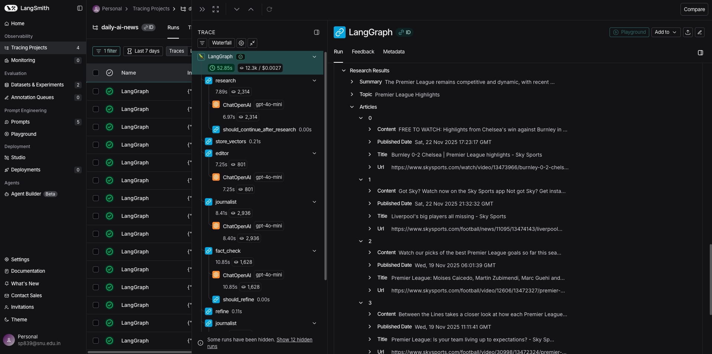
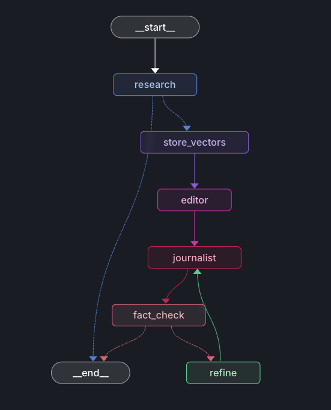

# The Daily AI: Personalized News Engine

Transform dry news articles into engaging content in multiple formats using AI agents.

[](https://www.python.org/downloads/)
[](https://opensource.org/licenses/MIT)

## 🎯 Overview
**The Daily AI** is an intelligent, multi-agent news generation system designed to transform how we consume information. In an era of information overload, this project leverages advanced Large Language Models (LLMs) to not just summarize news, but to re-contextualize and present it in engaging, personalized formats.

Using a sophisticated architecture powered by **LangGraph**, the system orchestrates a team of specialized AI agents—a **Researcher** 🔍, an **Editor** 📝, a **Journalist** ✍️, and a **Fact-Checker** ✅—to autonomously research topics, select compelling angles, write high-quality narratives, and verify facts. Whether you want your news delivered as a **1920s vintage newspaper** 📜, a **casual blog post** 💻, a **professional executive summary** 📊, or a **viral social media thread** 🧵, The Daily AI adapts the content while maintaining strict factual accuracy.

### Key Features

- 🔍 **Real-time News Research** - Searches latest articles using Tavily API
- 📝 **Multiple Output Formats** - Blog posts, vintage newspaper, professional reports, social media threads
- 🤖 **Multi-Agent System** - Specialized AI agents for research, editing, writing, and fact-checking
- ✅ **Fact Verification** - Automated fact-checking with confidence scoring
- 🎨 **Style Transfer** - Maintains facts while adapting tone and style
- 💾 **Semantic Search** - ChromaDB vector store for context retrieval


## 💡 Reason for Selecting this Project
This project was chosen because it perfectly encapsulates and applies the advanced concepts learned in **MAT496**. It moves beyond simple chatbot interactions to build a complex, autonomous system.

*   **🕸️ LangGraph & Multi-Agent Orchestration**: The core of the project is a cyclic graph managing the state between multiple agents. This demonstrates mastery of `State`, `Nodes`, and `Graph` concepts, specifically how to handle complex workflows with conditional edges (e.g., sending an article back for revision if fact-checking fails).
*   **🛠️ Tool Calling (MCP)**: The Researcher agent actively uses external tools (**Tavily API**) to fetch real-time data from the web, showcasing the ability of LLMs to interact with the outside world.
*   **📋 Structured Output**: To ensure the agents communicate effectively, strict **Pydantic** models are used. This enforces structured output (JSON) from the LLMs, which is critical for reliable system performance.
*   **🧠 Retrieval Augmented Generation (RAG)**: The system utilizes **ChromaDB** for semantic search, allowing it to retrieve relevant context and historical data to enrich the news stories, ensuring the content is not just current but also contextual.
*   **🎭 Prompting**: Advanced prompting techniques, including persona adoption and chain-of-thought reasoning, are implemented to guide each agent's specific behavior (e.g., the "Vintage Journalist" persona).
*   **✨ Creativity**: This project addresses a real-world problem—boring news—with a creative solution. It pushes the boundaries of what's possible by "outsourcing" the entire editorial process to a team of AI agents, something that would be impossible with traditional software engineering.

## 📋 Plan
I planned to execute these steps to complete my project. Each step represents a significant unit of work in building this system.

*   ✅ **[DONE] Step 1: Project Initialization & Environment Setup**
    *   Initialized the Git repository and set up the Python environment with necessary dependencies (`langgraph`, `langchain`, `streamlit`, `chromadb`). Configured secure environment variable handling for OpenAI and Tavily API keys.
*   ✅ **[DONE] Step 2: Architecture & State Design**
    *   Designed the global `AgentState` using Pydantic to track the flow of data (news topic, raw research, drafts, critique) between agents. Defined the graph topology including the feedback loops for quality control.
*   ✅ **[DONE] Step 3: Semantic Search Infrastructure (RAG)**
    *   Implemented the vector store using ChromaDB. Created utility functions to embed text and perform semantic retrieval, enabling the system to find related historical context for any given news topic.
*   ✅ **[DONE] Step 4: Researcher Agent Implementation**
    *   Built the Researcher node capable of utilizing the Tavily Search API. Implemented logic to parse raw search results and synthesize them into a comprehensive briefing document for the Editor.
*   ✅ **[DONE] Step 5: Editor Agent Development**
    *   Developed the Editor agent responsible for analyzing the research brief. Engineered prompts to have the Editor select the most engaging "angle" or "hook" for the story based on the user's requested format.
*   ✅ **[DONE] Step 6: Journalist Agent & Style Transfer Engine**
    *   Created the Journalist agent with dynamic prompt templates. Implemented the logic to swap writing styles (Vintage, Professional, Blog, Social Media) based on user input, ensuring the tone matches the desired output.
*   ✅ **[DONE] Step 7: Fact-Checker Agent & Verification Loop**
    *   Implemented a critical safety layer: the Fact-Checker agent. This agent compares the generated draft against the original research citations. If discrepancies are found, it triggers a conditional edge in the graph to send the draft back to the Journalist for revision.
*   ✅ **[DONE] Step 8: Graph Construction & Orchestration**
    *   Assembled the LangGraph workflow, connecting all nodes (Researcher -> Editor -> Journalist -> Fact-Checker). Defined the conditional routing logic to handle the "Approve" vs. "Revise" paths.
*   ✅ **[DONE] Step 9: Streamlit Web Interface**
    *   Built a responsive frontend using Streamlit. Created input forms for topic selection and format preferences, and implemented real-time status updates to show the user which agent is currently working.
*   ✅ **[DONE] Step 10: Testing & Refinement**
    *   Conducted extensive testing with various news topics to ensure robustness. Refined agent prompts to reduce hallucinations and improve the distinctiveness of the different writing styles.
*   ✅ **[DONE] Step 11: Documentation & Final Polish**
    *   Completed the project documentation, including setup guides and this comprehensive report. Cleaned up the codebase and ensured all type hints and comments were up to standard.

# 🚀 Quick Start

### Installation

```bash
# Clone the repository
git clone https://github.com/MAT496-Monsoon2025-SNU/Siddharth-Patel-Project---The-Daily-AI-Personalized-News-Engine-.git
cd Siddharth-Patel-Project---The-Daily-AI-Personalized-News-Engine-

# Install dependencies
pip install -r requirements.txt

# Configure API keys
cp .env.example .env
# Edit .env and add your OpenAI and Tavily API keys
```

### Running the Application

**Web Interface:**
```bash
streamlit run app.py
```
Open http://localhost:8501 in your browser.

**Command Line:**
```bash
python test_workflow.py "Your news topic here"
```

## 📖 Usage

1. **Enter a Topic** - Any news subject you're interested in
2. **Choose a Format**:
   - 📝 Blog Post - Casual and engaging
   - 📜 Vintage Newspaper - Classic 1920s-1940s style
   - 📊 Professional Report - Analytical and formal
   - 🧵 Social Media Thread - Concise tweets
3. **Generate** - Watch the live progress tracking
    
    *Real-time updates showing which agent is currently working*
4. **Read & Download** - View your personalized article with sources

## 🏗️ Architecture

### Multi-Agent System

```
┌─────────────┐    ┌──────────┐    ┌────────────┐    ┌──────────────┐
│  Researcher │ -> │  Editor  │ -> │ Journalist │ -> │ Fact-Checker │
└─────────────┘    └──────────┘    └────────────┘    └──────────────┘
      ↓                  ↓                ↓                   ↓
   Search            Select           Write              Verify
   News              Angle           Content            Accuracy
```

**Agents:**
- **Researcher** - Searches and analyzes news articles
- **Editor** - Selects interesting angles and tone
- **Journalist** - Writes in format-specific styles
- **Fact-Checker** - Verifies accuracy and suggests improvements

### System Architecture Visualization

*Visual representation of the multi-agent workflow orchestration in LangGraph*


*Detailed view of the agent nodes and connections*

### Technology Stack

| Component | Technology |
|-----------|-----------|
| Workflow Orchestration | LangGraph |
| LLM Integration | LangChain |
| Language Model | OpenAI GPT-4o-mini |
| News Search | Tavily API |
| Vector Database | ChromaDB |
| Web Interface | Streamlit |
| Data Validation | Pydantic |
## 🎭 Behind the Scenes


*How the AI agents collaborate to transform raw news into engaging content*

This visualization shows the complete flow from topic research through fact-checking, demonstrating the self-correcting loop that ensures accuracy while maintaining creativity.


## 📁 Project Structure

```
.
├── app.py                      # Streamlit web application
├── test_workflow.py            # CLI test script
├── requirements.txt            # Python dependencies
├── .env.example               # Environment variables template
└── src/
    ├── config.py              # Configuration management
    ├── state.py               # Pydantic state models
    ├── agents/                # Agent implementations
    │   ├── researcher.py      # Research agent
    │   ├── editor.py          # Editorial agent
    │   ├── journalist.py      # Writing agent
    │   └── fact_checker.py    # Fact-checking agent
    ├── graph/
    │   └── workflow.py        # LangGraph workflow
    ├── rag/
    │   └── vector_store.py    # ChromaDB integration
    ├── tools/
    │   └── tavily_search.py   # Tavily API wrapper
    └── utils/
        ├── prompts.py         # Prompt templates
        └── formatters.py      # Output formatters
```

## 📚 Documentation

- [Setup Guide](SETUP.md) - Detailed installation and configuration
- [Quick Start](QUICKSTART.md) - Get running in 5 minutes
- [Course Topics](COURSE_TOPICS.md) - Technical implementation details
- [Examples](examples/) - Sample outputs in all formats

## 🎭 Behind the Scenes


*How the AI agents collaborate to transform raw news into engaging content*

This visualization shows the complete flow from topic research through fact-checking, 
demonstrating the self-correcting loop that ensures accuracy while maintaining creativity.

## 🎨 Interface & Demo
### Web Interface

*The clean, intuitive web interface for generating personalized news*

### Demo Workflow

*Enter your topic and select your preferred format*


*Watch as AI agents process and generate your story*


*A sample blog-style output — conversational, engaging, and optimized for readability.*


*A sample professional report — concise, data-focused, and citation-forward for executive audiences.*


*Download or share your personalized news article*


**Creativity slider — the project's biggest selling point.**  
*Use this control to scale narrative inventiveness while preserving factual integrity. Higher values produce bolder storytelling and stylistic flair (great for viral/social outputs); lower values prioritize strict adherence to sources and formal tone (best for reports and executive summaries).*


## 📋 Example Outputs

See the [examples/](examples/) directory for sample outputs:
- [Blog Post](examples/example_blog.md)
- [Vintage Newspaper](examples/example_vintage.md)
- [Professional Report](examples/example_professional.md)
- [Social Media Thread](examples/example_social_thread.md)
## 🏁 Conclusion
I had planned to achieve a fully autonomous news agency that could mimic human editorial processes. I believe I have satisfactorily achieved the project goals. The system not only functions technically—successfully routing state between agents and calling external tools—but it also delivers on the creative promise. The "Vintage Newspaper" mode, in particular, demonstrates how LLMs can be used to completely reimagine content presentation. The inclusion of the self-correcting fact-check loop ensures that the creativity does not come at the cost of accuracy, fulfilling the rigorous requirements of a modern AI application.


## 🙏 Acknowledgments
-   **🎓 Course Instructor**: For the guidance on Agentic AI and LangGraph concepts.
- Built with [LangGraph](https://github.com/langchain-ai/langgraph) and [LangChain](https://github.com/langchain-ai/langchain)
- News search powered by [Tavily](https://tavily.com/)
- Vector database by [ChromaDB](https://www.trychroma.com/)
- UI built with [Streamlit](https://streamlit.io/)

---

**Made with ❤️ for MAT496 - Introduction to LLMS**